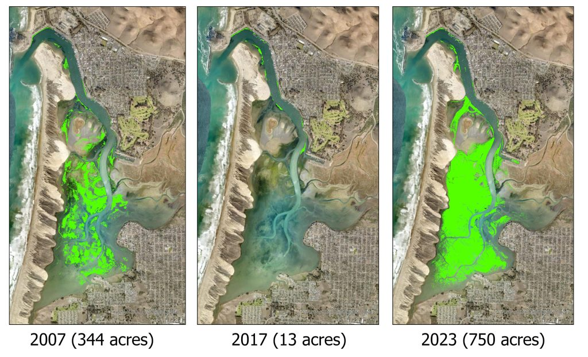
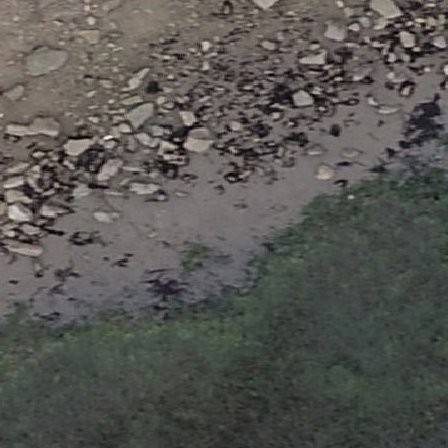
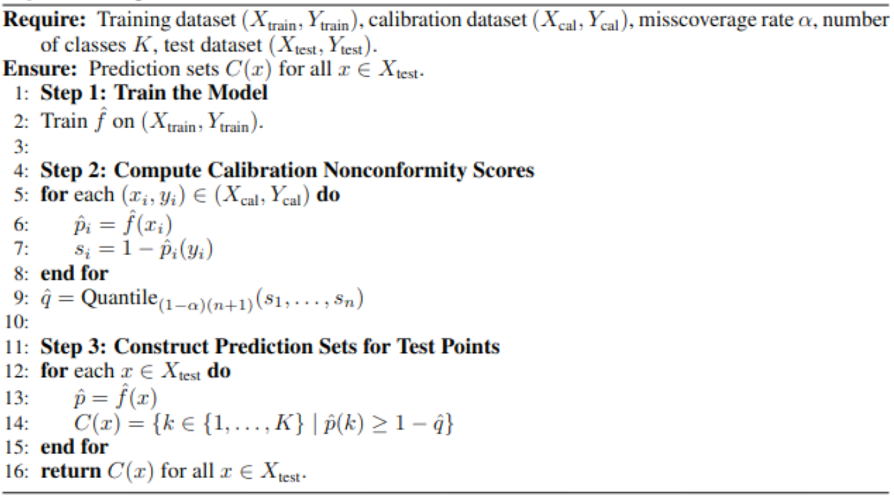

```{r}
#| echo: false
library(readr)
library(dplyr)
library(tidyr)
library(ggplot2)
library(kableExtra)

# used for ablation plots/tables in the thesis
ablation_summary <- read_csv("data/ablation_summary.csv")
```

## Background & Methods

------------------------------------------------------------------------



::: notes
Image from: https://www.mbnep.org/eelgrass/
:::

## Why eelgrass mapping matters

-   Eelgrass (*Zostera marina*) supports coastal ecosystems (habitat restoration, sediment stabilization, carbon sequestration)
-   Monitoring requires accurate maps over time (different imaging conditions)
-   Actual deployments need reliability: when should we trust the model?

## Core Problem: Domain Shift Breaks Confidence

-   Imagery can change year-to-year (tide height, lighting, turbidity, morphology, drone degradation)
-   A model can be confident yet wrong under drift
-   Want uncertainty quantification that flags:
    -   ambiguous pixels
    -   "shifted" regions where model less reliable

## Data: Morro Bay, California (2018–2022)

-   DJI Phantom 4 Pro drone orthomosaics of Morro Bay estuary, California
-   Labels:
    -   2018–2021: dense polygon annotations → rasterized labels
    -   2022: 1,000 human-labeled points (cheap evaluation)
-   Tiling: 448×448 chips, 50% overlap

------------------------------------------------------------------------

::: {.column width="50%"}
{width="100%"}
:::

::: {.column width="50%"}
{width="100%"}
:::

## Background Concepts

## Types of Uncertainty

-   Predictive uncertainty is the sum of aleotoric and epistemic uncertainties.
    -   Aleotoric: noise inherent to data
    -   Epistemic: model uncertainty (insufficient/shifted knowledge)
-   Under drift, a proxy for epistemic uncertainty should increase

## Deep Ensembles

-   Ensemble members $\{f_k\}_{k=1}^K$ output probabilities $p_y^{(k)}(x)$
-   Practical epistemic proxy - disagreement: $V(x) = Var_k(p_y^{(k)}(x))$

::: notes
Members disagree more on OOD/hard pixels → variance rises.
:::

## Model Architectures Used

-   Diverse heterogeneous ensemble (K=6):
    -   DeepLabv3+, U-Net, SAM-LoRA variants
    -   Single-year (2021) + multi-year (2018–2021) models

:::::: columns
::: {.column width="33%"}
{width="100%"}
:::

::: {.column width="33%"}
{width="100%"}
:::

::: {.column width="33%"}
{width="100%"}
:::
::::::

::: notes
Heterogeneous ensemble improves uncertainty diversity.

2 of each model architecture were added (1 single year 1 multi-year)

Training was performed using dual NVIDIA RTX 3090 GPUs, and took approximately one week for 4-year models and three days for single-year models.

The models were trained using the ArcGIS Learn Python module. For the two DeepLabV3+ models, we used a ResNet-101 backbone pre-trained on ImageNet, whereas the U-Net models, by default, use a ResNet-34 encoder. SAM-LoRA uses a pre-trained SAM encoder (vision transformer-based model) and inserts low-rank adapter layers to adapt the model for eelgrass segmentation, without fully tuning the model.
:::

## Split Conformal Prediction for Classification (vanilla baseline)



::: notes
Image: https://daniel-bethell.co.uk/posts/conformal-prediction-guide/

noncormity score is: $$s=1-p_y,$$ where $p_y$ is the model’s predicted probability for the true class y

Split CP: - Compute scores on a calibration set $C$ and get a threshold $\hat q_{\alpha}$ - prediction set: $$C_\alpha(x)=\{y:s(x)\leq\hat{q}_\alpha\}$$
:::

## Conformal Guarantees

1.  Finite-sample coverage guarantee (exact)
2.  For any data distribution (distribution-free)
3.  For any predictive model (model-free)

Two main limitations:

1.  Marginal coverage
2.  Exchangeability assumption

::: notes
In binary: set is empty, singleton, or two-label set.

Key limitation: exchangeability breaks under shift → undercoverage.
:::

## CP Under Drift

-   In 2022, difficult / OOD pixels shift the score distribution: $\hat q_{\alpha}$ becomes too lenient
-   Existing approaches are difficult to apply in high-dimensional drone imagery segmentation
-   Instead tailor difficulty-normalized CP, using ensemble disagreement as a shift-aware normalizer

::: notes
Existing approaches require continuous labels, density estimation, and additional assumptions that are not possible in high-dimensional expensive eelgrass segmentation.

Difficulty-normalized conformal prediction has been used to address heteroskedasticity and local uncertainty. Here we apply that idea to drift in the drone imagery.
:::

## Variance-Aware Score Normalization

## Method 1: Parametric Linear Scaling

Replace vanilla score s with $s_i^\star = s_i/g(v_i), i \in C$. Then do split cp on $s^\star$.

$$S_{\lambda}(x,y)=\frac{S(x,y)}{1+\lambda V(x)},\quad \lambda \geq 0.$$

-   Assume scores increase linearly with difficulty

-   Choose $\lambda$ via grid search balancing OOD coverage and % singletons (efficiency)

## Method 2: Nonparametric Normalization

$$S=a(V)U,\quad a(V)>0,\quad U \perp \!\!\! \perp V \Rightarrow$$

$$ S'(x,y) = \frac{S(x,y)}{\hat a(V(x))}, \quad \hat a(V) \approx \mathbb{E}[S \mid V] $$

-   Assume scores increase multiplicatively

-   Learn non-linear scaling a(v), no tuning parameter

::: notes
Estimate $\hat a(V) \approx \mathbb{E}[S \mid V]$ on 2021 calibration:
- quantile-bin variance (equal sized bins)
- compute the average score for each variance bin
- interpolate to define a continuous function
:::

## Evaluation Metrics

Primary:

- Global coverage vs target $\alpha$
- Set composition: % empty/singleton/two-label

Additional:

- class-conditional coverage
- coverage vs variance bins
- spatial robustness

## Ensemble Results


-----

::: {#fig-ensemble-chip layout-ncol="1" fig-pos="H"}
{style="max-height:85vh; width:auto; display:block; margin:0 auto;"}

Example ensemble inference outputs on a 2022 chip: Raw chip (+ point), ensemble mean probability, ensemble variance, and argmax segmentation.
:::

::: notes
Here is a representative 2022 chip with the ensemble outputs. This includes
the raw chip imagery, the ensemble mean probability for the target class, the ensemble
variance, and the final class segmentation. Visually, it seems that high ensemble variance
aligns with boundaries between eelgrass and non-eelgrass patches as well as ambiguous
pixels, such as darker shadows or where features resemble eelgrass RGB. In the example
chip, it can be clearly seen that the variance spikes at the boundary between eelgrass and
non-eelgrass patches. These results suggest that the disagreement signal is capturing the
genuinely difficult pixels in the imagery.
:::

----

```{r}
#| label: tbl-ensemble-performance
#| echo: false
#| warning: false
#| tbl-cap: "Pixel-wise performance of the ensemble and individual segmentation models on the 2022 evaluation points."
#| results: asis

ensemble_tbl <- data.frame(
  TrainingYear = c("N/A",
  "2021", "2021", "2021",
  "2018–2021", "2018–2021", "2018–2021"),
  Model = c("Ensemble",
  "U-Net", "SAM LoRA", "DeepLab",
  "U-Net", "SAM LoRA", "DeepLab"),
  Precision = c(0.9046,
  0.82, 0.82, 0.88,
  0.88, 0.81, 0.88),
  Recall = c(0.8688,
  0.89, 0.89, 0.80,
  0.78, 0.80, 0.89),
  F_Score = c(0.8864,
  0.86, 0.85, 0.84,
  0.83, 0.81, 0.86),
  Accuracy = c(0.9100,
  0.88, 0.87, 0.88,
  0.87, 0.84, 0.89)
)

colnames(ensemble_tbl) <- c("Training Year", "Model", "Precision",
                            "Recall", "F Score", "Accuracy")

ensemble_tbl |>
  knitr::kable(digits = 3, align = "c") |>
  kable_styling(
    font_size = 30,     
    full_width = FALSE
  )
```

::: notes
The heterogeneous ensemble achieves an accuracy of 0.910 and an F-score of 0.886, outperforming all individual members, whose accuracies range from 0.840–0.890 and F-scores from 0.810–0.860.
:::

## In-Distribution Evaluation

----


```{r}
#| label: tbl-id-lambda
#| echo: false
#| warning: false
#| tbl-cap: 'In-distribution (2021 test) coverage and set composition for vanilla CP, linear variance-normalized scores across ($\lambda$), and the nonparametric normalizer at $\alpha = 0.1$.'
#| results: asis

id_lambda_tbl <- data.frame(
  Method      = c("Vanilla",
  "Linear (λ = 0.5)",
  "Linear (λ = 1.0)",
  "Linear (λ = 2.0)",
  "Linear (λ = 3.0)",
  "Linear (λ = 4.0)",
  "Nonparametric"),
  qhat        = c(0.3169, 0.2975, 0.2810, 0.2540, 0.2332, 0.2163, 1.5115),
  Coverage    = c(0.900, 0.900, 0.900, 0.900, 0.900, 0.900, 0.900),
  Pct_single  = c(93.9, 93.9, 93.9, 93.9, 93.8, 93.7, 94.5),
  Pct_empty   = c(6.1, 6.1, 6.1, 6.1, 6.0, 6.1, 4.5),
  Pct_two     = c(0.0, 0.0, 0.0, 0.0, 0.1, 0.2, 1.0)
)

colnames(id_lambda_tbl) <- c("Method", "q-hat",
  "Coverage", "% singletons",
  "% empty", "% two-label")
  
  id_lambda_tbl |>
  knitr::kable(digits = 3) |> 
  kable_styling(
    font_size = 30,     
    full_width = FALSE
  )
```

::: notes
Main takeaway from in-distribution evaluation is that the normalization doesn't break the conformal validity in the in-distribution setting. Differences in the set composition are also very minor; under drift is where the methods begin to differ.
:::

## Temporal OOD (2022)

## Linear Normalization 

----

```{r}
#| label: tbl-ood-lambda
#| echo: false
#| warning: false
#| tbl-cap: 'Temporal OOD (2022) global coverage and set composition for vanilla CP and linear variance-normalized scores across $\lambda$ at $\alpha = 0.1$.'
#| results: asis

ood_lambda_tbl <- data.frame(
Method      = c("Vanilla",
"Linear (λ = 0.5)",
"Linear (λ = 1.0)",
"Linear (λ = 2.0)",
"Linear (λ = 3.0)",
"Linear (λ = 4.0)"),
Coverage    = c(0.860, 0.867, 0.871, 0.891, 0.901, 0.908),
Pct_single  = c(92.7, 94.4, 95.4, 95.6, 93.8, 92.4),
Pct_empty   = c(7.3, 5.6, 4.5, 3.0, 2.5, 2.1),
Pct_two     = c(0.0, 0.0, 0.1, 1.4, 3.7, 5.5)
)

colnames(ood_lambda_tbl) <- c("Method", "Coverage",
"% singletons", "% empty", "% two-label")

ood_lambda_tbl |>
knitr::kable(digits = 3) |> 
  kable_styling(
  font_size = 30,     
  full_width = FALSE
)
```

::: notes
- Vanilla: 0.860 vs target 0.900 → strong undercoverage.
- Increasing λ recovers coverage monotonically.
:::

----

::: {#fig-cov-vs-lambda layout-ncol="1" fig-pos="H"}
{style="max-height:85vh; width:auto; display:block; margin:0 auto;"}

Overall coverage and singleton % on 2022 OOD points as a function of the linear shrink parameter $(\lambda)$ at $(\alpha = 0.1)$.
:::

::: notes
- Trade-off with set composition
- $\lambda=3$ chosen as the best choice, as it is first value to retain target coverage (0.901) while still increasing singletons and only a modest increase in two-class sets.
:::

## Nonparametric Normalization

---- 

::: {#fig-empirical-calibration-comparison layout-ncol="1" fig-pos="H"}
{style="max-height:85vh; width:auto; display:block; margin:0 auto;"}

Estimated normalization scale from 2021 calibration compared to the empirical score-variance relationship observed in 2022. The extension shows extrapolation beyond calibration support.
:::

::: notes
- steep rise in low-variance region: nonlinearity matters. 
- The plot shows midpoint of equal sized bins, as seen there is a much higher proportion of low variance points in the ID data compared to OOD.
- The estimated function captures the shape of the scores relatively well. Although there is some slight deviations as variance increases, the overall trend remains the same, and points to the estimated scale being conservative rather than undercovering.
:::

----

```{r}
#| label: tbl-ood-het
#| echo: false
#| warning: false
#| tbl-cap: 'Temporal OOD (2022) global coverage and set composition for Vanilla CP, Linear normalization $(\lambda = 3)$, and the Nonparametric normalizer at $\alpha = 0.1$.'
#| results: asis

ood_unified_tbl <- data.frame(
Method              = c("Vanilla",
"Linear (λ = 3.0)",
"Nonparametric"),
EstimatedThreshold  = c(0.31691, 0.2332, 1.51146),
OverallCoverage     = c(0.860, 0.901, 0.906),
PctSingleton        = c(92.7, 93.8, 96.4),
PctEmpty            = c(7.3, 2.5, 0.8),
PctTwoLabel         = c(0.0, 3.7, 2.8)
)

colnames(ood_unified_tbl) <- c("Method",
"q-hat",
"Coverage",
"% singletons",
"% empty",
"% two-label")

ood_unified_tbl |>
knitr::kable(digits = 3) |> 
  kable_styling(
  font_size = 30,     
  full_width = FALSE
)
```

::: notes
- Nonparametric performs best overall even when compared to best $\lambda$. (highest singletons and higher coverage)
:::

----

{style="max-height:85vh; width:auto; display:block; margin:0 auto;"}

::: notes
- vanilla declines with variance -> fails on harder points
- nonparametric is closest to flat near target, desired behavior (conditional-ish)
:::

## Class-conditional coverage (2022)

----

```{r}
#| label: tbl-class-cond-2022
#| echo: false
#| warning: false
#| tbl-cap: 'Per-class coverage on 2022 OOD points at $\alpha = 0.1$ for vanilla CP, linear normalization $(\lambda = 3)$, and the nonparametric normalizer.'

class_cond_tbl <- data.frame(
Method      = c("Vanilla",
"Linear (λ = 3.0)",
"Nonparametric"),
Coverage_bg = c(0.914, 0.943, 0.946),
Coverage_eg = c(0.780, 0.839, 0.847),
Diff = c(0.134, 0.104, 0.099)
)

colnames(class_cond_tbl) <- c("Method",
"Coverage (background)",
"Coverage (eelgrass)",
"Difference")

class_cond_tbl |>
knitr::kable(digits = 3) |> 
  kable_styling(
  font_size = 30,     
  full_width = FALSE
)
```

## Spatial 
::: notes
morton/z-ordering is a way of converting 2D spatial coordinates (x, y) into a single 1D index while preserving spatial locality.

2D coordinates  are transformed by taking the first bit of x, then the first bit of y, the second bit of x, and so on following a recursive Z pattern.
:::