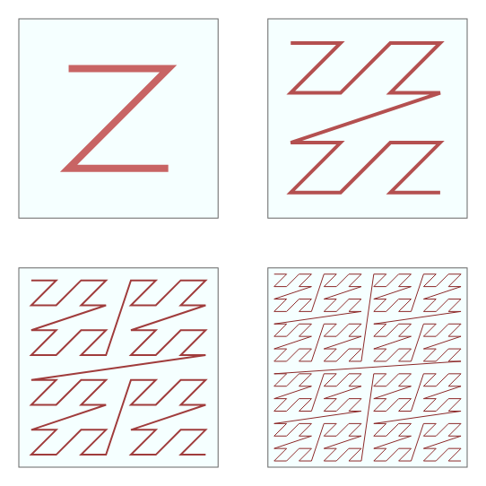

```{r}
#| echo: false
library(readr)
library(dplyr)
library(tidyr)
library(ggplot2)
library(kableExtra)

# used for ablation plots/tables in the thesis
ablation_summary <- read_csv("data/ablation_summary.csv")
```

## Background & Methods

------------------------------------------------------------------------


::: notes
Eelgrass is one of the most important habitats in estuaries, while also being some of the most threatened habitats. As seen in this image from the Morro Bay National Estuary program, we can see the major decline in eelgrass in Morro Bay which led to many monitoring, research, and restoration efforts with Cal Poly, Cuesta College, and other organzations that has managed to restore eelgrass coverage.

Image from: https://www.mbnep.org/eelgrass/
:::

## Why eelgrass mapping matters

-   Eelgrass (*Zostera marina*) supports coastal ecosystems (habitat restoration, sediment stabilization, carbon sequestration)
-   Monitoring requires accurate maps over time (different imaging conditions)
-   Actual deployments need reliability: when should we trust the model?

## Core Problem: Domain Shift Breaks Confidence

-   Imagery can change year-to-year (tide height, lighting, turbidity, morphology, drone degradation)
-   A model can be confident yet wrong under drift
-   Want uncertainty quantification that flags:
    -   ambiguous pixels
    -   "shifted" regions where model less reliable

## Data: Morro Bay, California (2018–2022)

-   DJI Phantom 4 Pro drone orthomosaics of Morro Bay estuary, California
-   Labels:
    -   2018–2021: dense polygon annotations → rasterized labels
    -   2022: 1,000 human-labeled points (cheap evaluation)
-   Tiling: 448×448 chips, 50% overlap

------------------------------------------------------------------------

::: {.column width="50%"}
{width="100%"}
:::

::: {.column width="50%"}
{width="100%"}
:::

## Background Concepts

## Types of Uncertainty

-   Predictive uncertainty is the sum of aleotoric and epistemic uncertainties.
    -   Aleotoric: noise inherent to data
    -   Epistemic: model uncertainty (insufficient/shifted knowledge)
-   Under drift, a proxy for epistemic uncertainty should increase

## Deep Ensembles

-   Ensemble members $\{f_k\}_{k=1}^K$ output probabilities $p_y^{(k)}(x)$
-   Practical epistemic proxy - disagreement: $V(x) = Var_k(p_y^{(k)}(x))$

::: notes
Members disagree more on OOD/hard pixels → variance rises.
:::

## Model Architectures Used

-   Diverse heterogeneous ensemble (K=6):
    -   DeepLabv3+, U-Net, SAM-LoRA variants
    -   Single-year (2021) + multi-year (2018–2021) models

:::::: columns
::: {.column width="33%"}
{width="100%"}
:::

::: {.column width="33%"}
{width="100%"}
:::

::: {.column width="33%"}
{width="100%"}
:::
::::::

::: notes
Heterogeneous ensemble improves uncertainty diversity.

2 of each model architecture were added (1 single year 1 multi-year)

Training was performed using dual NVIDIA RTX 3090 GPUs, and took approximately one week for 4-year models and three days for single-year models.

The models were trained using the ArcGIS Learn Python module. For the two DeepLabV3+ models, we used a ResNet-101 backbone pre-trained on ImageNet, whereas the U-Net models, by default, use a ResNet-34 encoder. SAM-LoRA uses a pre-trained SAM encoder (vision transformer-based model) and inserts low-rank adapter layers to adapt the model for eelgrass segmentation, without fully tuning the model.
:::

## Split Conformal Prediction for Classification (vanilla baseline)


::: notes
Image: https://daniel-bethell.co.uk/posts/conformal-prediction-guide/

noncormity score is: $$s=1-p_y,$$ where $p_y$ is the model’s predicted probability for the true class y

Split CP: - Compute scores on a calibration set $C$ and get a threshold $\hat q_{\alpha}$ - prediction set: $$C_\alpha(x)=\{y:s(x)\leq\hat{q}_\alpha\}$$
:::

## Conformal Guarantees

1.  Finite-sample coverage guarantee (exact)
2.  For any data distribution (distribution-free)
3.  For any predictive model (model-free)

Two main limitations:

1.  Marginal coverage
2.  Exchangeability assumption

::: notes
In binary: set is empty, singleton, or two-label set.

Key limitation: exchangeability breaks under shift → undercoverage.
:::

## CP Under Drift

-   In 2022, difficult / OOD pixels shift the score distribution: $\hat q_{\alpha}$ becomes too lenient
-   Existing approaches are difficult to apply in high-dimensional drone imagery segmentation
-   Instead tailor difficulty-normalized CP, using ensemble disagreement as a shift-aware normalizer

::: notes
Existing approaches require continuous labels, density estimation, and additional assumptions that are not possible in high-dimensional expensive eelgrass segmentation.

Difficulty-normalized conformal prediction has been used to address heteroskedasticity and local uncertainty. Here we apply that idea to drift in the drone imagery.
:::

## Variance-Aware Score Normalization

## Method 1: Parametric Linear Scaling

Replace vanilla score s with $s_i^\star = s_i/g(v_i), i \in C$. Then do split cp on $s^\star$.

$$S_{\lambda}(x,y)=\frac{S(x,y)}{1+\lambda V(x)},\quad \lambda \geq 0.$$

-   Assume scores increase linearly with difficulty

-   Choose $\lambda$ via grid search balancing OOD coverage and % singletons (efficiency)

## Method 2: Nonparametric Normalization

$$S=a(V)U,\quad a(V)>0,\quad U \perp \!\!\! \perp V \Rightarrow$$

$$ S'(x,y) = \frac{S(x,y)}{\hat a(V(x))}, \quad \hat a(V) \approx \mathbb{E}[S \mid V] $$

-   Assume scores increase multiplicatively

-   Learn non-linear scaling a(v), no tuning parameter

::: notes
Estimate $\hat a(V) \approx \mathbb{E}[S \mid V]$ on 2021 calibration: - quantile-bin variance (equal sized bins) - compute the average score for each variance bin - interpolate to define a continuous function
:::

## Evaluation Metrics

Primary:

-   Global coverage vs target $\alpha$
-   Set composition: % empty/singleton/two-label

Additional:

-   class-conditional coverage
-   coverage vs variance bins
-   spatial robustness

## Ensemble Results

------------------------------------------------------------------------

::: {#fig-ensemble-chip layout-ncol="1" fig-pos="H"}
{style="max-height:85vh; width:auto; display:block; margin:0 auto;"}

Example ensemble inference outputs on a 2022 chip: Raw chip (+ point), ensemble mean probability, ensemble variance, and argmax segmentation.
:::

::: notes
Here is a representative 2022 chip with the ensemble outputs. This includes the raw chip imagery, the ensemble mean probability for the target class, the ensemble variance, and the final class segmentation. Visually, it seems that high ensemble variance aligns with boundaries between eelgrass and non-eelgrass patches as well as ambiguous pixels, such as darker shadows or where features resemble eelgrass RGB. In the example chip, it can be clearly seen that the variance spikes at the boundary between eelgrass and non-eelgrass patches. These results suggest that the disagreement signal is capturing the genuinely difficult pixels in the imagery.
:::

------------------------------------------------------------------------

```{r}
#| label: tbl-ensemble-performance
#| echo: false
#| warning: false
#| tbl-cap: "Pixel-wise performance of the ensemble and individual segmentation models on the 2022 evaluation points."
#| results: asis

ensemble_tbl <- data.frame(
  TrainingYear = c("N/A",
  "2021", "2021", "2021",
  "2018–2021", "2018–2021", "2018–2021"),
  Model = c("Ensemble",
  "U-Net", "SAM LoRA", "DeepLab",
  "U-Net", "SAM LoRA", "DeepLab"),
  Precision = c(0.9046,
  0.82, 0.82, 0.88,
  0.88, 0.81, 0.88),
  Recall = c(0.8688,
  0.89, 0.89, 0.80,
  0.78, 0.80, 0.89),
  F_Score = c(0.8864,
  0.86, 0.85, 0.84,
  0.83, 0.81, 0.86),
  Accuracy = c(0.9100,
  0.88, 0.87, 0.88,
  0.87, 0.84, 0.89)
)

colnames(ensemble_tbl) <- c("Training Year", "Model", "Precision",
                            "Recall", "F Score", "Accuracy")

ensemble_tbl |>
  knitr::kable(digits = 3, align = "c") |>
  kable_styling(
    font_size = 30,     
    full_width = FALSE
  )
```

::: notes
The heterogeneous ensemble achieves an accuracy of 0.910 and an F-score of 0.886, outperforming all individual members, whose accuracies range from 0.840–0.890 and F-scores from 0.810–0.860.
:::

## In-Distribution Evaluation

------------------------------------------------------------------------

```{r}
#| label: tbl-id-lambda
#| echo: false
#| warning: false
#| tbl-cap: 'In-distribution (2021 test) coverage and set composition for vanilla CP, linear variance-normalized scores across ($\lambda$), and the nonparametric normalizer at $\alpha = 0.1$.'
#| results: asis

id_lambda_tbl <- data.frame(
  Method      = c("Vanilla",
  "Linear (λ = 0.5)",
  "Linear (λ = 1.0)",
  "Linear (λ = 2.0)",
  "Linear (λ = 3.0)",
  "Linear (λ = 4.0)",
  "Nonparametric"),
  qhat        = c(0.3169, 0.2975, 0.2810, 0.2540, 0.2332, 0.2163, 1.5115),
  Coverage    = c(0.900, 0.900, 0.900, 0.900, 0.900, 0.900, 0.900),
  Pct_single  = c(93.9, 93.9, 93.9, 93.9, 93.8, 93.7, 94.5),
  Pct_empty   = c(6.1, 6.1, 6.1, 6.1, 6.0, 6.1, 4.5),
  Pct_two     = c(0.0, 0.0, 0.0, 0.0, 0.1, 0.2, 1.0)
)

colnames(id_lambda_tbl) <- c("Method", "q-hat",
  "Coverage", "% singletons",
  "% empty", "% two-label")
  
  id_lambda_tbl |>
  knitr::kable(digits = 3) |> 
  kable_styling(
    font_size = 30,     
    full_width = FALSE
  )
```

::: notes
Main takeaway from in-distribution evaluation is that the normalization doesn't break the conformal validity in the in-distribution setting. Differences in the set composition are also very minor; under drift is where the methods begin to differ.
:::

## Temporal OOD (2022)

## Linear Normalization

------------------------------------------------------------------------

```{r}
#| label: tbl-ood-lambda
#| echo: false
#| warning: false
#| tbl-cap: 'Temporal OOD (2022) global coverage and set composition for vanilla CP and linear variance-normalized scores across $\lambda$ at $\alpha = 0.1$.'
#| results: asis

ood_lambda_tbl <- data.frame(
Method      = c("Vanilla",
"Linear (λ = 0.5)",
"Linear (λ = 1.0)",
"Linear (λ = 2.0)",
"Linear (λ = 3.0)",
"Linear (λ = 4.0)"),
Coverage    = c(0.860, 0.867, 0.871, 0.891, 0.901, 0.908),
Pct_single  = c(92.7, 94.4, 95.4, 95.6, 93.8, 92.4),
Pct_empty   = c(7.3, 5.6, 4.5, 3.0, 2.5, 2.1),
Pct_two     = c(0.0, 0.0, 0.1, 1.4, 3.7, 5.5)
)

colnames(ood_lambda_tbl) <- c("Method", "Coverage",
"% singletons", "% empty", "% two-label")

ood_lambda_tbl |>
knitr::kable(digits = 3) |> 
  kable_styling(
  font_size = 30,     
  full_width = FALSE
)
```

::: notes
-   Vanilla: 0.860 vs target 0.900 → strong undercoverage.
-   Increasing λ recovers coverage monotonically.
:::

------------------------------------------------------------------------

::: {#fig-cov-vs-lambda layout-ncol="1" fig-pos="H"}
{style="max-height:85vh; width:auto; display:block; margin:0 auto;"}

Overall coverage and singleton % on 2022 OOD points as a function of the linear shrink parameter $(\lambda)$ at $(\alpha = 0.1)$.
:::

::: notes
-   Trade-off with set composition
-   $\lambda=3$ chosen as the best choice, as it is first value to retain target coverage (0.901) while still increasing singletons and only a modest increase in two-class sets.
:::

## Nonparametric Normalization

------------------------------------------------------------------------

::: {#fig-empirical-calibration-comparison layout-ncol="1" fig-pos="H"}
{style="max-height:85vh; width:auto; display:block; margin:0 auto;"}

Estimated normalization scale from 2021 calibration compared to the empirical score-variance relationship observed in 2022. The extension shows extrapolation beyond calibration support.
:::

::: notes
-   steep rise in low-variance region: nonlinearity matters.
-   The plot shows midpoint of equal sized bins, as seen there is a much higher proportion of low variance points in the ID data compared to OOD.
-   The estimated function captures the shape of the scores relatively well. Although there is some slight deviations as variance increases, the overall trend remains the same, and points to the estimated scale being conservative rather than undercovering.
:::

------------------------------------------------------------------------

```{r}
#| label: tbl-ood-het
#| echo: false
#| warning: false
#| tbl-cap: 'Temporal OOD (2022) global coverage and set composition for Vanilla CP, Linear normalization $(\lambda = 3)$, and the Nonparametric normalizer at $\alpha = 0.1$.'
#| results: asis

ood_unified_tbl <- data.frame(
Method              = c("Vanilla",
"Linear (λ = 3.0)",
"Nonparametric"),
EstimatedThreshold  = c(0.31691, 0.2332, 1.51146),
OverallCoverage     = c(0.860, 0.901, 0.906),
PctSingleton        = c(92.7, 93.8, 96.4),
PctEmpty            = c(7.3, 2.5, 0.8),
PctTwoLabel         = c(0.0, 3.7, 2.8)
)

colnames(ood_unified_tbl) <- c("Method",
"q-hat",
"Coverage",
"% singletons",
"% empty",
"% two-label")

ood_unified_tbl |>
knitr::kable(digits = 3) |> 
  kable_styling(
  font_size = 30,     
  full_width = FALSE
)
```

::: notes
-   Nonparametric performs best overall even when compared to best $\lambda$. (highest singletons and higher coverage)
:::

------------------------------------------------------------------------

::: {#fig-cov-vs-var layout-ncol="1" fig-pos="H"}
{style="max-height:85vh; width:auto; display:block; margin:0 auto;"}

Coverage on 2022 OOD points as a function of ensemble-variance bins for vanilla, linear $(\lambda = 3)$, and nonparametric normalization.
:::

::: notes
-   vanilla declines with variance -\> fails on harder points
-   nonparametric is closest to flat near target, desired behavior (conditional-ish)
:::

## Class-conditional coverage (2022)

------------------------------------------------------------------------

```{r}
#| label: tbl-class-cond-2022
#| echo: false
#| warning: false
#| tbl-cap: 'Per-class coverage on 2022 OOD points at $\alpha = 0.1$ for vanilla CP, linear normalization $(\lambda = 3)$, and the nonparametric normalizer.'

class_cond_tbl <- data.frame(
Method      = c("Vanilla",
"Linear (λ = 3.0)",
"Nonparametric"),
Coverage_bg = c(0.914, 0.943, 0.946),
Coverage_eg = c(0.780, 0.839, 0.847),
Diff = c(0.134, 0.104, 0.099)
)

colnames(class_cond_tbl) <- c("Method",
"Coverage (background)",
"Coverage (eelgrass)",
"Difference")

class_cond_tbl |>
knitr::kable(digits = 3) |> 
  kable_styling(
  font_size = 30,     
  full_width = FALSE
)
```

::: notes
-   harder class is eelgrass, normalization is able to slightly help the disparity between classes. Nonparametric more so than linear.
:::

## Spatial Robustness

------------------------------------------------------------------------

::::::: columns
:::: {.column width="50%"}
::: {#fig-spatial}
{width="100%"}

Spatial blocks (10 equal-count spatial blocks formed by Morton/Z-ordering)
:::
::::

:::: {.column width="50%"}
::: {#fig-zorder}
{width="100%"}

Four iterations of the Z-order curve (from Wikipedia)
:::
::::
:::::::

::: notes
-   partition 1,000 points into 10 spatial blocks using Morton ordering, for evaluating local stability
-   Morton (Z-order) indexing converts 2D spatial coordinates into a 1D ordering while preserving locality.
-   It works by interleaving the binary bits of x and y coordinates, producing a recursive Z-shaped traversal pattern.
:::

------------------------------------------------------------------------

:::::: columns
::: {.column width="40%"}
```{r}
#| label: tbl-spatial-diagnostics
#| echo: false
#| warning: false
#| tbl-cap: "Spatial robustness diagnostics on 2022 OOD points."
#| results: asis

spatial_tbl <- data.frame(
  Method               = c("Vanilla", "Linear (λ = 3.0)", "Nonparametric"),
  BlockCoverageSD      = c(0.0494, 0.0401, 0.0357),
  CorMeanVarCoverage_r = c(-0.622, -0.416, -0.206),
  CorMeanVarCoverage_p = c(0.0546, 0.2314, 0.5689)
)

colnames(spatial_tbl) <- c("Method", "SD", "Correlation r", "p-value")

spatial_tbl |>
  knitr::kable(digits = 3, align = "c") |>
  kable_styling(full_width = FALSE, font_size = 20)
```
:::

:::: {.column width="60%"}
::: {#fig-cov-vs-var-spatial layout-ncol="1" fig-pos="H"}


Scatter plot of block-wise coverage vs mean variance for vanilla, linear $(\lambda=3)$, and nonparametric methods
:::
::::
::::::

::: notes
-   Vanilla: highest spatial variability + strongest negative variance/coverage correlation.
-   Nonparametric: best equity (lowest SD) and weakest correlation.
:::

------------------------------------------------------------------------

```{=html}
<style>
.reveal figcaption { font-size: 0.6em !important; }
</style>
```

::: {#fig-var-block}
{style="max-height:42vh; width:auto; display:block; margin:auto;"}

Per-block mean variance for 2022 points
:::

::: {style="height:5vh;"}
:::

::: {#fig-cov-vs-block}
{style="max-height:42vh; width:auto; display:block; margin:auto;"}

Per-block coverage for 2022 points for vanilla, linear $(\lambda=3)$, and nonparametric methods
:::

::: notes
-   In the above figure we can see the variance of each block. Blocks 2, 3, 5, 6, and 9 are all high variance blocks
-   Below figure shows comparison of coverage on each block. Vanilla does very poorly for all high variance blocks except 9 which seems to be an outlier. Nonparametric seems to do best.
:::

## Visual Method Comparison

------------------------------------------------------------------------

::: {#fig-clipped-raster layout-ncol="2" fig-pos="H"}
{style="max-height:85vh; width:auto; display:block; margin:0 auto;"}

{style="max-height:85vh; width:auto; display:block; margin:0 auto;"}

Visuals of the 2022 raster and overlayed ground truth points (Blue = Other, Green = Eelgrass).
:::

::: notes
These images provide a general understanding of the data. On the left we can see the entire Morro Bay raster, and on the right the overlayed labeled points. As seen, majority of eelgrass is centered in the middle of the estuary.
:::

------------------------------------------------------------------------

::: {#fig-spatial-sets layout-ncol="1" fig-pos="H"}
{style="max-height:85vh; width:auto; display:block; margin:0 auto;"}

Set composition overlay for 2022 raster for vanilla, linear $(\lambda=3)$, and nonparametric methods.
:::

::: notes
Figure 11 displays the set composition of each method. As seen in the image, there appears to be a high uncertainty region towards the top end of the estuary. For this region, the vanilla CP method reported a majority of incorrect singletons or empty sets, while the normalized methods converted many of these into two-class sets.
:::

------------------------------------------------------------------------

::: {#fig-transitions layout-ncol="1" fig-pos="H"}
{style="max-height:85vh; width:auto; display:block; margin:0 auto;"}

Set composition changes from vanilla for linear $(\lambda=3)$ and nonparametric methods. Counts for each transition type are reported in the legend.
:::

::: notes
Here is a slightly simplified view, which just shows the set composition changes from vanilla to normalized methods.

For both, many of the two-set class transitions occur in the same relative area, indicating both methods identify similar high-difficulty areas of the estuary where the vanilla method was confident and wrong. Compared to the linear normalizer, the nonparametric method produces a larger number of empty-to-singleton transitions
:::

------------------------------------------------------------------------

::: {#fig-chip-compare layout-ncol="1" fig-pos="H"}
{style="max-height:85vh; width:auto; display:block; margin:0 auto;"}

Chip-level set prediction comparison on a representative 2022 point (GT = eelgrass). Both vanilla and linear methods return empty sets at that pixel, while the nonparametric method returns the correct singleton {eelgrass}.
:::

::: notes
This figure provides an interesting example of how variance normalization can change the predictions. At the labeled point, the ensemble mean predicts eelgrass with low confidence ($\hat p \approx 0.56$), yet the corresponding ensemble variance is also fairly low ($\hat v \approx 0.045$). This is a case where predictive uncertainty is relatively high (pixel is intrinsically ambigious, so we have high entropy/low confidence) but epistemic uncertainty is low (the ensemble members agree, resulting in low variance). As a result, both vanilla CP and linear variance-normalized method produce an empty set prediction at the labeled point. In contrast, the nonparametric method, retains eelgrass as the correct singleton set prediction.

We can see these results even more clearly in the entire segmented chip, vanilla CP results in a large portion of empty sets in areas of ambiguity (borders between eelgrass and other as well as darker shadows). The linear method is able to shrink these ambiguous areas to singletons and two-set classes (as seen by the thinner strips between other and eelgrass) but still has a large portion of empty set predictions. Nonparametric is able to further shrink the area of ambiguity, while also producing almost no empty sets, instead providing more informative 2 class sets.
:::

## Sensitivity Analysis

------------------------------------------------------------------------

```{r}
#| label: tbl-ablation-2022
#| echo: false
#| warning: false
#| message: false
#| tbl-cap: 'Coverage and set composition on 2022 OOD points across $\alpha \in \{0.10, 0.05, 0.025\}$.'

ablation_2022_tbl <- ablation_summary |>
  filter(domain == "2022_OOD") |>
  arrange(alpha, method) |>
  transmute(
    alpha,
    Method    = method,
    Coverage  = coverage_overall,
    Empty     = 100 * pct_empty,
    Single    = 100 * pct_single,
    Two_label = 100 * pct_two
  )

# row ranges for each alpha group
group_info <- ablation_2022_tbl |>
  mutate(row_id = row_number()) |>
  group_by(alpha) |>
  summarise(
    start = min(row_id),
    end   = max(row_id),
    .groups = "drop"
  )

# table body without the alpha column
tbl_body <- ablation_2022_tbl |>
  select(-alpha)

tab <- tbl_body |>
  knitr::kable(
    digits = c(3, 3, 1, 1, 1),
    col.names = c(
      "Method",
      "Coverage",
      "Empty (%)",
      "Single (%)",
      "Two-label (%)"
    ),
    booktabs = TRUE
  ) |>
  kable_styling(full_width = FALSE, font_size = 20)

# add “Alpha = ...” subsections
for (i in seq_len(nrow(group_info))) {
  tab <- tab |>
    group_rows(
      paste0("α = ", group_info$alpha[i]),
      group_info$start[i],
      group_info$end[i]
    )
}

tab
```

::: notes
-   Main trend persists across all alpha levels, vanilla undercovers, normalization recovers the lost coverage to at or near target levels.
-   At very low $\alpha$ tradeoffs are more pronounce, as we see a laerge increase in two-class sets, intuitively makes sense if we are trying to ensure such high confidence.
-   Continue to graphs for a more intuitive visual comparison
:::

------------------------------------------------------------------------

::::: columns
::: {.column width="50%"}
```{r}
#| label: fig-ablation-coverage-2022
#| echo: false
#| warning: false
#| out-width: "100%"
#| fig-width: 9
#| fig-height: 6
#| fig-cap: 'Coverage across $\alpha \in \{0.1, 0.05, 0.025\}$. Dashed line shows the target coverage 1 - α.'

ablation_2022 <- ablation_summary |>
  filter(domain == "2022_OOD")

gg_coverage <- ggplot(
  ablation_2022,
  aes(x = factor(alpha),
      y = coverage_overall,
      color = method,
      group = method)
) +
  geom_point(size = 2) +
  geom_line() +
  # target line(s): 1 - alpha
  geom_hline(
    data = distinct(ablation_2022, alpha, target_cov),
    aes(yintercept = target_cov),
    linetype = "dashed",
    color   = "grey40"
  ) +
  labs(
    x = expression(alpha),
    y = "Coverage",
    color = "Method"
  ) +
  coord_cartesian(ylim = c(0.85, 1)) +
  theme_minimal(base_size = 20) +
  theme(
    legend.position = "top"
  )

gg_coverage
```
:::

::: {.column width="50%"}
```{r}
#| label: fig-ablation-setcomp-2022
#| echo: false
#| warning: false
#| out-width: "100%"
#| fig-width: 9
#| fig-height: 6
#| fig-cap: 'Set composition (empty, single, two-label) across $\alpha \in \{0.1, 0.05, 0.025\}$.'

setcomp_2022 <- ablation_summary |>
  filter(domain == "2022_OOD") |>
  select(method, alpha, pct_empty, pct_single, pct_two) |>
  pivot_longer(
    cols = starts_with("pct_"),
    names_to = "SetType",
    values_to = "Pct"
  ) |>
  mutate(
    SetType = recode(
      SetType,
      pct_empty  = "Empty",
      pct_single = "Single",
      pct_two    = "Two-label"
    ),
    Pct   = 100 * Pct,
    alpha = factor(alpha)   # keep alphas ordered but treat as factor for faceting
  )

gg_setcomp <- ggplot(
  setcomp_2022,
  aes(x = method, y = Pct, fill = SetType)
) +
  geom_col(position = "stack") +
  facet_wrap(
    ~ alpha,
    nrow = 1,
    labeller = labeller(alpha = function(x) paste0("alpha = ", x))
  ) +
  labs(
    x = "",
    y = "Set composition (%)",
    fill = "Set type"
  ) +
  theme_minimal(base_size = 20) +
  theme(
    axis.text.x = element_text(angle = 25, hjust = 0.75),
    strip.text  = element_text(size = 9)
  )+
  theme(
    legend.position = "top"
  )

gg_setcomp
```
:::
:::::

::: notes
- Method are not providing overly conservative estimates.
:::

## Takeaways

1.  Ensemble improves accuracy and provides useful uncertainty
2.  ID: all conformal methods meet target coverage
3.  OOD (2022): vanilla CP undercovers, ensemble variance normalization recovers lost coverage
4.  Improved coverage vs variance and improved spatial equity
5.  Nonparametric seemed to work best and requires no parameter tuning.

## Limitations

- Formal CP guarantees require exchangeability. This only target empircal robustness.
- Assumes score–variance relationship transfers across years (may fail under larger shifts)
- 2022 uses point labels (not full dense raster labels)
- Ensembles add compute cost

## Conclusion

- Ensemble disagreement provides a practical way to make conformal prediction sets more reliable under slight shift for eelgrass segmentation.
- Works as a post-hoc wrapper: no retraining, no test-time labels

## Questions?
