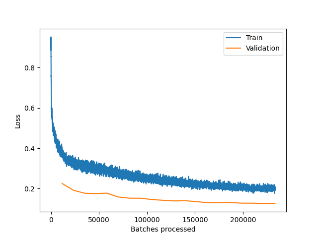
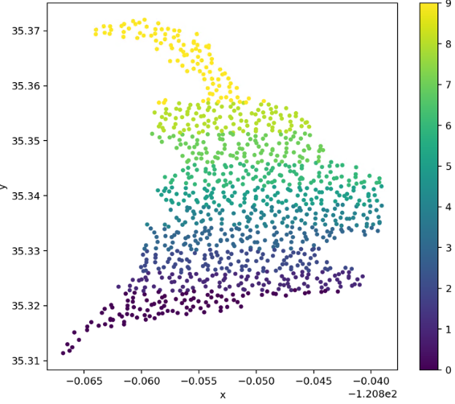
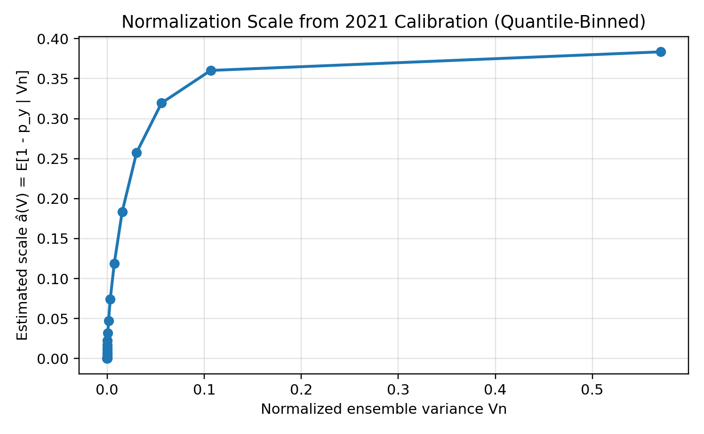
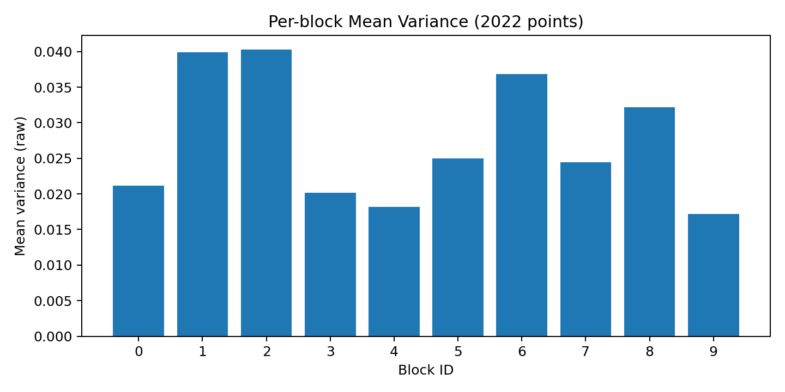
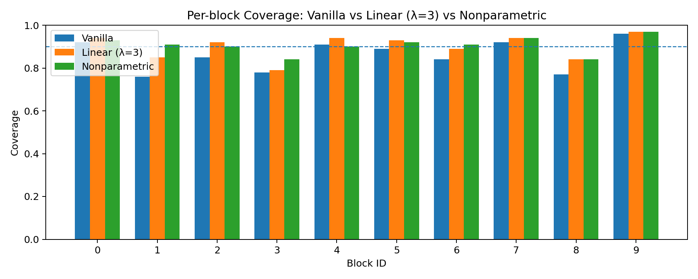
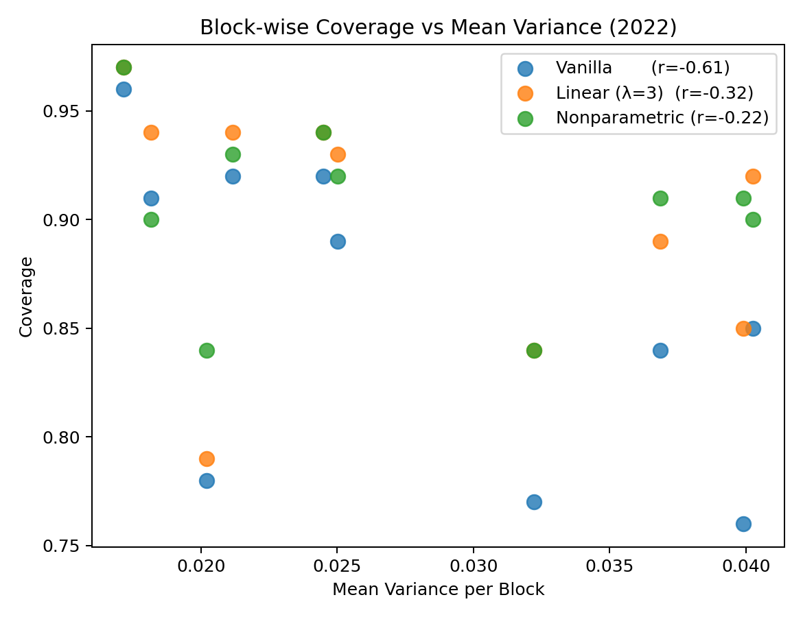
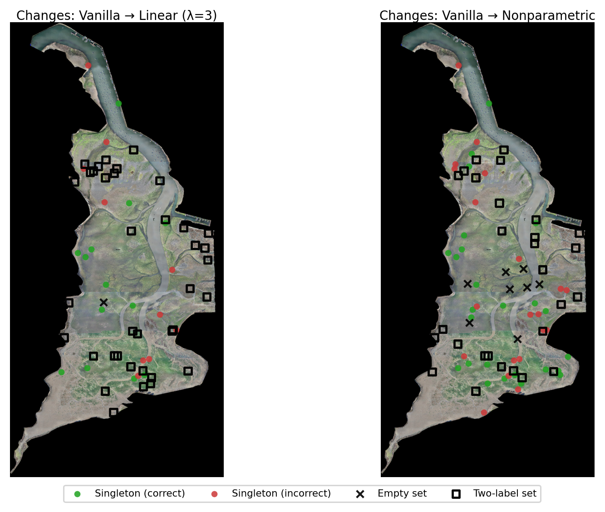

---
execute:
  warning: false
  message: false
format:
  pdf:
    documentclass: report
    papersize: letter
    fontsize: 12pt
    mainfont: Times New Roman
    geometry:
      - left=1.5in
      - right=1in
      - top=1in
      - bottom=1in
    include-before-body:
      - frontmatter/information.tex
      - frontmatter/title-page.tex
      - frontmatter/copyright-page.tex
      - frontmatter/committee-page.tex
      - frontmatter/abstract.tex
      - frontmatter/acknowledgments.tex
      - frontmatter/table-of-contents.tex
    number-sections: true
    citation-style: apa
    bibliography: bibliography/example-bibliography.bib
    csl: bibliography/apa-6th-edition.csl
    include-in-header: frontmatter/formating.tex
---

```{r}
#| echo: false
#| message: false

library(readr)
library(dplyr)
library(tidyr)
library(ggplot2)
library(kableExtra)

ablation_summary <- read_csv("data/ablation_summary.csv")
```

# Introduction

Eelgrass (*Zostera marina*) is a seagrass species of temperate waters that provides an anchor to coastal ecosystems by providing sediment stabilization, carbon sequestration, eliminating contamination, and providing habitats for protected species. Warming oceans, storm regimes, and local disturbance have quickly reshaped the intertidal morphology and habitat extent. As these threats increase, there is a need to monitor changes to determine appropriate environmental management. In recent years, deep networks have made this intertidal mapping practical in complex imagery, achieving strong pixel-wise accuracy in areas such as Morro Bay, California [@tallam2023]. However, the reliability of general utilization of these classification models not only relies on high-accuracy segmentation, but also on rigorous uncertainty quantification under temporal and spatial distribution shift. Imagery collected over different years, at different tides or seasons, can erode the model's calibration, causing it to be over-confident. This study builds off these models to create a post hoc uncertainty framework.

Uncertainty quantification is a requirement for flagging ambiguous areas. To answer this, split conformal prediction provides an appealing framework. It offers a wrapping of any probabilistic predictor to produce prediction sets with finite-sample marginal coverage under exchangeability, simply by using a calibration set and a quantile nonconformity score [@angelopoulos2021]. In classification, a natural choice of noncormity score is $s=1-p_y$, yielding a prediction set of all labels whose scores do not exceed a global threshold learned on calibration. With stable data, this can be simple and effective; however, in reality, the distribution of scores can differ by difficulty. A threshold calibrated over one year can underperform when a distributional shift occurs, such as temporal drift.

To remedy this, it is necessary to make the conformal prediction adaptive to drift or local difficulty. First, work in adaptive or locally weighted CP in regression has shown that normalizing scores by a measure of local difficulty can make a single global quantile more appropriate across heterogeneous inputs, which improves approximate conditional behavior [@lei2018; @chernozhukov2021; @dewolf2025]. Second, research on uncertainty in deep learning has demonstrated that diversified deep ensembles provide practical, shift-aware signals of difficulty that tend to grow on out-of-distribution inputs [@lakshminarayanan2017]. Using these ideas, this study implements a simple strategy for rescaling the classification score by a calibration-learned difficulty proxy, so that the global threshold becomes conservative under drift, without the need for recalibration or labels.

This thesis develops this design for eelgrass segmentation of multi-year drone imagery. The proposed normalizers are deliberately simple to adopt into existing pipelines. This includes: 1. a linear normalization $s'=(1-p_y)/(1+\lambda V)$ where $V$ summarizes ensemble disagreement and $\lambda$ controls degree of conservativeness and 2. a learned normalizer $s'=s/\hat{a}(V)$ where $\hat{a}(V)=\text{E}[s|V]$ is estimated on the calibration split via quantile binning and interpolation. Both approaches retain standard CP workflow and require no labels at test time or retraining.

# Background and Motivation

Effective eelgrass monitoring requires models that both provide accurate predictions, as well as how certain they are for those predictions. This section reviews the uncertainty concepts used in deep learning.

## Uncertainty in Deep Learning

Uncertainty in predictive modeling is commonly broken up into two components: *epistemic* and *aleotoric*. These two components collectively comprise the total uncertainty in a model's predictions. Aleatoric uncertainty represents the noise inherent in observations, which is often impossible to remove, even with the addition of more data (e.g. sensor noise or true label ambiguity). Even a perfect model cannot remove it. Epistemic uncertainty represents the uncertainty of the model itself, which can be reduced with additional or higher-quality data [@kendall2017].

For modern vision models, raw softmax probabilities are often miscalibrated, meaning the outputted confidence does not match empirical accuracy. This can be especially prevalent under shift, where models can be confident yet wrong. Post-hoc calibration, such as temperature scaling, rescales logits via $\text{softmax}(z/T)$ and improves in-distribution calibration without changing accuracy [@guo2017]. Under shift, however, calibration is not enough, as the structure of the errors can change. Thus, it requires an uncertainty representation that integrates decision rules that signal the difficulty of the prediction.

## Deep Ensembles

Deep ensembles can address uncertainty by aggregating predictions from models trained independently with different initializations or architectures. For estimating epistemic uncertainty, member disagreements can be calculated by considering the variance in member probabilities or logits. Given members $\{f_k\}_{k=1}^K$ that produce $p^{(k)}(x)$, $V(x) = Var_k(p_y^{(k)}(x))$. Ensembles have not only been found to be more robust under shift, but taking epistemic uncertainty specifically into account can greatly increase a model's predictive uncertainty under dataset shift [@ovadia2019]. Additionally, ensembles require no specialized inference and can easily integrate with existing training code, providing a difficulty proxy for uncertainty. This does come at the additional computational cost of training additional models. However, many models are often trained in pursuit of classification accuracy, which, when ensembled, can outperform individual models.

## Semantic Segmentation in Environmental Monitoring

Semantic image segmentation is a deep learning neural network technique that assigns class labels to each pixel within an image, delineating objects. Recent work demonstrates that deep networks can accurately classify intertidal eelgrass from drone imagery at useful resolutions [@tallam2023]. Environmental monitoring can pose unique challenges, as not only are annotations costly and sometimes ambiguous, but the habitat is constantly shifting over seasonal and annual time scales. Even at the same site, small variations such as time of day, tidal height, etc, can alter the conditions of the imagery.

## Conformal Prediction Foundations

Conformal prediction provides a model and distribution-free technique to convert probability scores into prediction sets with finite-sample marginal coverage under exchangeability [@angelopoulos2021]. For a classifier with probabilities $p(x)$, a simple *nonconformity score* is $s=1-p_y$, which is small when the model is confident in the true class. In split conformal prediction, scores are computed on a calibration set $C$ of size $n$ and the finite-sample-corrected quantile is selected $\hat{q}_\alpha = \operatorname{Quantile}_{\lceil (n + 1)(1 - \alpha) \rceil / n}(\{s_i\})$, then the set value prediction is outputed $$C_\alpha(x)=\{y:s\leq\hat{q}_\alpha\}$$ This procedure guarantees $P\{Y∈C_\alpha(X)\}\geq1-\alpha$ for new points exchangeable with $C$, regardless of the underlying model. Two limitations of conformal prediction motivate this thesis. The first limitation is that the guarantee is marginal. This means there is no guarantee of conditional coverage, that the per class coverage will be $\geq$ target, and that coverage is not guaranteed across differing inputs, such as varying difficulty. Second, conformal prediction has mathematical validity due to the concept of symmetry (data could have been seen in any order) as long as the data is exchangeable. Coverage guarantees are lost as distribution drifts, and the model can become overly confident, leading to under-coverage. To address these problems, we need to use an adaptive variant of conformal prediction, which is more conservative for harder inputs.

## Adaptive or Shift-Aware CP

There is a substantial amount of literature that aims to make CP adaptive to heterogeneity or robust during dataset drift.

In regression, locally-weighted CP normalizes residuals by an estimate of local spread to equalize scores for a global quantile under heterogeneity [@lei2018]. Distributional conformal prediction (DCP) transforms the score using an estimate of the conditional cumulative distribution function. If the distribution of the score is stable conditional on covariates, then a single global quantile should be appropriate across those covariates [@chernozhukov2021].

The two ideas loosely connect to this variance score normalization. Let $S=s(X,Y)$ denote the standard noncomformity score and let $V=V(X)$ be a one-dimensional proxy from the deep ensemble (member-probability variance after temperature scaling). We can use this proxy to stabilize the score with respect to $V$, rather than estimating an ultra-high-dimensional $F_{S|X}$ as in DCP. Additionally, we do not estimate a full conditional CDF transform and instead normalize under a multiplicative difficulty assumption $$S=a(V)U,\quad a(V)>0,\quad U \perp \!\!\! \perp V.$$ Then, $S'=S/a(V)\approx U$, so $S'|V$ becomes approximately invariant, and locally tuned to difficulty. Normalization targets the actual failure under shift, that the global threshold will become too lenient for the hard OOD inputs. On the calibration set, we estimate $\hat{a} \approx E[S|V=v]$ via quantile binning and smooth interpolation, and then conformalize the normalized score $S’=S/\hat{a}(V)$. Thus, if the conditional distribution $S|V=v$ is roughly the same across years: $$S∣V=v (calibration)\approx S∣V=v (test),$$ then we expect the normalized scores to be approximately stable conditional on $V$. Then the global quantile will be appropriate across the shifted years. Intuitively, pixels with large member disagreements (hard pixels) would have larger scores. Dividing by $\hat{a}(V)$ will equalize the scores, so that hard and easy pixels are all scored equally, being precise on easy inputs and conservative on difficult ones. By using a difficulty signal (epistemic uncertainty) that is specifically “shift-aware,” we expect that the score becomes shift-aware as well.

# Methodology

## Data

This study uses imagery of the estuary in Morro Bay, California. The data was collected between 2018 and 2022. Eelgrass was mapped using a DJI Phantom 4 Pro drone with a high-resolution camera. Data was collected between the months of November and January (of the following year) during days of extreme low tides, when eelgrass is exposed. Flight times were approximately 1 hour due to limitations of tide duration. High-resolution estuary-wide orthomosaics were acquired (\~5000 images per year) and manually annotated to delineate between eelgrass and non-eelgrass polygons by a team of GIS specialists, as mentioned in @tallam2023. This includes iterative validation checks, resulting in \~1000 hours spent per year. The resulting polygons were rasterized to match imagery, resulting in pixel-wise labels for semantic segmentation.

For model development, imagery from 2018-2021 is treated as in-distribution (ID), while imagery from 2022 is treated as temporally out-of-distribution (OOD). For 2022, instead of fully labeling the orthomosaic (which, as mentioned, can be very expensive), a set of 1000 randomly sampled points was labeled as either eelgrass or non-eelgrass. The 2018-2021 data was tiled into chips of size 448x448 pixels and a stride of 224 pixels, resulting in 50% overlap between chips.

::: {#fig-chip-example layout-ncol="2" fig-pos="H"}
{fig-alt="Original drone tile of Morro Bay estuary"}

{fig-alt="Manual annotation raster label"}

Example 448×448 px tile from the drone orthomosaic and corresponding manually digitized eelgrass label.
:::

2021 was chosen as the *calibration year* as it is the most recent pre-2022 year. For 2021, the data was partitioned into four subsets: 1. a train subset (together with 2018-2020), 2. a small temperature-scaling subset to estimate the models' over- or underconfidence in their softmax probabilities, 3. a CP calibration subset to compute conformal scores and quantiles, and 4. an evaluation subset to test in-distribution coverage. The OOD 2022 evaluation set is thus never used in training, temperature scaling, or conformal calibration.

## Model Training and Inference Pipeline

### Segmentation Ensemble

To obtain the epistemic uncertainty proxy and achieve high-accuracy predictions, we trained a heterogeneous deep ensemble of semantic segmentation models to increase model diversity. In total $K=6$ models were added to the ensemble. Of the 6, 2 of each model architecture were chosen. These architectures include DeepLabv3+, UNet, and two variants of Segment Anything Model (SAM) that were fine-tuned with low-rank adapters (Sam-LoRA). Each model type had one multi-year (2018-202) model in the ensemble and a single-year (2021 only) model. Training was performed using dual NVIDIA RTX 3090 (24 GB VRAM) GPUs, and took approximately one week for 4-year models and three days for single-year models.

The models were trained using the ArcGIS Learn Python module. For the two DeepLabV3+ models, we used a ResNet-101 backbone pre-trained on ImageNet, whereas the U-Net models, by default, use a ResNet-34 encoder. SAM-LoRA uses a pre-trained SAM encoder (vision transformer-based model) and inserts low-rank adapter layers to adapt the model for eelgrass segmentation, without fully tuning the model.

::: {#fig-architectures layout-ncol="2" fig-pos="H"}
{fig-alt="Diagram of the SAM-LoRA segmentation model architecture used in this study, adapted from ArcGIS Learn documentation."}

{fig-alt="Diagram of the U-Net architecture with encoder–decoder skip connections, adapted from ArcGIS Learn documentation."}

{fig-alt="Diagram of the DeepLabv3+ architecture with atrous spatial pyramid pooling, adapted from ArcGIS Learn documentation."}

Model architectures included in the ensemble. Images from the ArcGIS Learn developer guides.
:::

Models were trained for 20 epochs, and using a held-out validation set, the best checkpoint (best validation loss) was selected to be included in the ensemble.

::: {#fig-loss layout-ncol="1" fig-pos="H"}


Example training and validation loss curve for DeepLabV3 4 year model
:::

### Probability Calibration and Aggregation

At inference time, each of the models produces per-pixel logits, which are then temperature-scaled, converted to class probabilities, and then aggregated. Temperature scaling calibrates the model confidence using a scalar temperature $T_k > 0$, which is calculated by minimizing the negative log-likelihood on the temperature-scaling calibration subset [@guo2017]. For each model $f_k$, producing logits $z^{(k)}(x)$, probabilities are then converted using temperature scaled softmax $$p^{(k)}(x; T_k) = \text{softmax}(\frac{z^{(k)}(x)}{T_k}).$$

We then compute the ensemble-averaged calibrated probability for class $y$ at pixel $x$, $$\hat{p}_y(x)= \frac{1}{K} \sum_{k=1}^K p^{(k)}_y(x; T_k).$$ The ensemble prediction is thus the argmax aggregated probability. Each model’s individual probability output is also retained for computing the epistemic uncertainty proxy.

For each labeled point x, we compute the epistemic proxy based on member disagreement for the true class, $$V(x) = Var_k(p^{(k)}_y(x; T_k)),\quad y=y_{\text{true}(x)}.$$ To assess how the proxy relates to errors, we use selective accuracy curves and correlation analyses. This was done with the variance scores (our epistemic proxy), as well as entropy and mutual information uncertainty scores for comparison. However, these were not chosen to be tested in conformalizing equations as they mix aleatoric and epistemic uncertainties and are implicitly used in the probability-based nonconformity scores $1-\hat{p}_y$. For a given uncertainty score $u(x)$, labeled points are sorted by decreasing $u(x)$. We then iteratively recompute accuracy scores on smaller and smaller subsets of less uncertain points. For an informative uncertainty metric (that ranks errors well), we should observe a monotonic increase in accuracy as coverage decreases.

## Split CP for Classification

The ensemble model is treated as a single probabilistic classifier for conformal prediction. We apply split conformal prediction to obtain per-pixel prediction sets with finite-sample coverage under exchangeability [@angelopoulos2021]. For each labeled pixel $x$ and class $y$, we define a nonconformity score such as the vanilla $S(x,y) = 1-\hat{p}(x)$, which is large when the model assigns a low probability to the true class (nonconforming). On the 2021 calibration subset $C$ of size $n$, we compute nonconformity scores on all pixels. Then sort the pixels and compute the finite-sample corrected empirical $(1-\alpha)$ quantile $\hat{q}_\alpha = \operatorname{Quantile}_{\lceil (n + 1)(1 - \alpha) \rceil / n}(\{s_i\})$ for a target miscoverage level. For a new pixel, the CP set is $$C_{\alpha}(x)
= \left\{\, y \in \{\text{eelgrass},\,\text{background}\} : S(x,y) \le \hat{q}_{\alpha} \,\right\}.$$ Under the assumption that the calibration and test data are exchangeable, marginal coverage is guaranteed: $\Pr\{\, Y \in C_{\alpha}(X) \,\} \ge 1 - \alpha.$ CP sets are computed for both a held-out 2021 ID set and the 1,000 labeled 2022 OOD points. We used the vanilla score to provide a baseline for OOD data coverage compared to the variance-aware methods.

## Variance-Aware Score Normalization

As discussed in the background, split CP can under cover in hard or OOD regions since the score distribution will be larger where the classifier is less reliable. We address this by normalizing by the difficulty proxy, ensemble variance.

Let $V(x)$ denote the ensemble variance at pixel $x$. For each calibration point $x_i$, we have a pair $(S_i,V_i)$. The general form of normalized scores can then be defined as $$S^\star(x,y)=\frac{S(x,y)}{g(V(x))},$$ where $g(\cdot)$ is a positive scaling function learned on the calibration set. Split CP is then applied to $S_i^\star = S_i/g(V_i), i \in C$, which yields a new threshold $\hat{q}_\alpha^\star$ and new prediction sets $$C_\alpha^\star(x)=\left\{\, y : S^\star(x,y) \le \hat{q}_\alpha^\star \,\right\}.$$

Intuitively, where V(x) is large (ensemble model disagrees; model is uncertain), $g(v)$ is larger and thus $S^\star$ shrinks. This makes it more lenient in hard/OOD regions, reducing under-coverage. Two choices of $g$ were tested, a simple parametric linear variance scaler and a nonparametric normalization based on the relationship between $S$ and $V$. For both methods, we first scale $V$ using the calibration $V$ min and $V$ max so that the values are roughly between 0 and 1.

### Parametric Linear Scaling

For the parametric version, we create a simple relationship between variance and shrinkage: $$S_{\lambda}(x,y)=\frac{S(x,y)}{1+\lambda V(x)},\quad \lambda \geq 0.$$ $\lambda$ controls how aggressively we shrink the score in high-variance regions. For $\lambda=0$, $S_{\lambda}$ simply reduces to the vanilla score. $\lambda$ was optimized via a small manual grid search of $\lambda \in {0,0.5,1,2,4}$. $\lambda$ was chosen to optimize a balance of two metrics: 1. improving OOD coverage, and 2. retaining a high percentage of singletons (more on CP evaluation in Section 3.5). This method remains a very simple “drop-in” method on top of vanilla split CP.

### Nonparametric Normalization

The parametric shrink assumes a linear relationship between difficulty and the appropriate scale correction. To better match the empirical behavior, we also tested a nonparametric normalization that estimates the correction function $a(v)$ from the data. We assume a multiplicative difficulty model $$S=a(V)U,\quad a(V)>0,\quad U \perp \!\!\! \perp V.$$ Under this assumption, dividing by $a(v)$ should remove most of the dependence of $S$ on $V$. On the calibration set, we estimate $a(\cdot)$ using a smoothed estimate of the conditional mean $E[S|V=v]$. This is done by first partitioning the calibration set into $B=20$ bins $B_1, \ldots , B_B$ based on quantiles of $V$, so that each bin has roughly an equal number of points. For each bin, we then compute the mean variance $v_b$ and the mean score $\sigma_b$. These $(v_b, \sigma_b)$ pairs summarize the typical score magnitude at difficulty around $v_b$. We then construct a continuous estimate $\hat a(v)$ by interpolating linearly between the bin centers, treating ${v_b}$ as x-values and ${\sigma_b}$ as y-values, yielding a function defined for all $v$.

The key assumption is that the relationship between score and difficulty is approximately invariant across the adjacent years. If $S|V=v (2021) \approx S|V=v (2022)$, then the single global quantile behaves as if locally tuned to difficulty in both the calibration year and the shifted year.

## CP Evaluation

To evaluate the performance of vanilla and variance-aware CP under temporal drift, two main metrics were evaluated with a few complementary metrics. The first, and most important, evaluating metric is global marginal coverage. This can simply be calculated as the proportion of evaluation sets including the ground truth: $\text{Coverage} = \frac{1}{N}\sum_{i=1}^{N} \mathbf{1}\{\, y_i \in C(x_i) \,\}.$ This is then compared to the target $1-\alpha$ coverage. The next metric to take a look at is the set composition. For each pixel, the prediction set can be empty ($\emptyset$), a singleton ({eelgrass} or {other}), or the full set ({eelgrass, other}). We report the proportion of each category and can use this to measure the efficiency of the sets. A good conformal model in binary settings aims to maximize the number of singletons while retaining coverage $\geq$ target.

Beyond the main evaluation metrics, we added a few complementary metrics to evaluate each method. The first is class-conditional coverage. To assess whether coverage is balanced between eelgrass and other, we compute the coverage for each individual class: $\text{Coverage}_y = \frac{1}{N_y}\sum_{i=1}^{N_y} \mathbf{1}\{\, y_i \in C(x_i) \,\}, \quad y \in \{\text{eelgrass, other}\}.$ Next, to examine the effectiveness of normalization, we examine the coverage vs. difficulty. We bin points into quantiles of $V$ and compute coverage within each bin to produce coverage vs. variance curves. Lastly, we wanted to evaluate not only how the methods handle the temporal drift but also the spatial heterogeneity, such as some areas of the estuary being more difficult to classify than others. To assess spatial robustness, we performed PCA and ordered the 2022 points along the first principal component of their coordinates. Then partition them into $B=10$ equal-sized blocks (n=100), and compute coverage within each block. We summarize spatial equity by the standard deviation of block-wise coverage and by the correlation between block-wise coverage and block-wise mean V. More metrics and visuals were also created that will be included within the results; however, these capture the main evaluation metrics.

::: {#fig-spatial}
{width="80%"}

Spatial blocks (10 equal-count bands via PCA)
:::

# Results

## Ensemble Results

@fig-ensemble-chip shows a representative 2022 chip with the ensemble outputs. This includes the raw chip imagery, the ensemble mean probability for the target class, the ensemble variance, and the final argmax segmentation. Visually, it seems that high ensemble variance aligns with boundaries between eelgrass and non-eelgrass patches as well as ambiguous pixels, such as darker shadows or where features resemble eelgrass RGB. In the example chip, it can be clearly seen that the variance spikes at the boundary between eelgrass and non-eelgrass patches. These results suggest that the disagreement signal is capturing the genuinely difficult pixels in the imagery.

::: {#fig-ensemble-chip layout-ncol="1" fig-pos="H"}


Example ensemble inference outputs on a 2022 chip: Raw chip (+ point), ensemble mean probability, ensemble variance, and argmax segmentation.
:::

@tbl-ensemble-performance summarizes the pixel-wise performance of the ensemble and individual models on the 1,000 2022 points for comparison. The heterogeneous ensemble achieves an accuracy of 0.910 and an F-score of 0.886, outperforming all individual members, whose accuracies range from 0.840–0.890 and F-scores from 0.810–0.860. This aligns with previous literature on deep ensembles, which has reported higher accuracy and better-calibrated uncertainty compared to individual models. Another important note is that the precision (0.905) and recall (0.886) are relatively balanced for the deep ensemble.

```{r}
#| label: tbl-ensemble-performance
#| echo: false
#| warning: false
#| tbl-cap: "Pixel-wise performance of the ensemble and individual segmentation models on the 2022 evaluation points."

ensemble_tbl <- data.frame(
  TrainingYear = c("N/A",
  "2021", "2021", "2021",
  "2018–2021", "2018–2021", "2018–2021"),
  Model = c("Ensemble",
  "U-Net", "SAM LoRA", "DeepLab",
  "U-Net", "SAM LoRA", "DeepLab"),
  Precision = c(0.9046,
  0.82, 0.82, 0.88,
  0.88, 0.81, 0.88),
  Recall = c(0.8688,
  0.89, 0.89, 0.80,
  0.78, 0.80, 0.89),
  F_Score = c(0.8864,
  0.86, 0.85, 0.84,
  0.83, 0.81, 0.86),
  Accuracy = c(0.9100,
  0.88, 0.87, 0.88,
  0.87, 0.84, 0.89)
)

colnames(ensemble_tbl) <- c("Training Year", "Model", "Precision",
                            "Recall", "F Score", "Accuracy")

ensemble_tbl |>
  knitr::kable(digits = 3)
```

To assess how informative the uncertainty measure is, we created selective-accuracy curves on the 2021 in-distribution test set in @fig-selective-accuracy-2021. The graph plots 3 metrics: predictive entropy, mutual information, and ensemble variance. For all three metrics, selective accuracy increases sharply as we remove the most uncertain points and then plateaus at an accuracy of about 0.98 for all metrics. This confirms that each metric is meaningfully ordering the errors. The area under the selective accuracy curve (SAUC) is highest for entropy (0.9682) and then closely followed by variance (0.9619), suggesting entropy is the best for ordering the errors. However, as mentioned previously, since entropy is implicitly used in the vanilla conformal score and because variance can directly act as a proxy for epistemic uncertainty, growing under drift, variance is still chosen as the metric of choice.

::: {#fig-selective-accuracy-2021 layout-ncol="1" fig-pos="H"}


Selective accuracy-coverage curves on the 2021 in-distribution test set for entropy-based and variance-based uncertainty scores.
:::

## In-Distribution Evaluation

@tbl-id-lambda displays the coverage and set composition on the 2021 test set for vanilla split CP, linear variance-normalized scores across the $\lambda$ grid, and the nonparametric normalizer, all at a target $\alpha = 0.1$. As expected, all methods achieved the marginal coverage of 0.9 in 2021. The coverage was very tight, as all methods achieved exactly 0.900 coverage. This confirms that the scores were correctly calibrated in distribution. 

```{r}
#| label: tbl-id-lambda
#| echo: false
#| warning: false
#| tbl-cap: 'In-distribution (2021 test) coverage and set composition for vanilla CP, linear variance-normalized scores across ($\lambda$), and the nonparametric normalizer at $\alpha = 0.1$.'

id_lambda_tbl <- data.frame(
  Method      = c("Vanilla",
  "Linear (λ = 0.5)",
  "Linear (λ = 1.0)",
  "Linear (λ = 2.0)",
  "Linear (λ = 3.0)",
  "Linear (λ = 4.0)",
  "Nonparametric"),
  qhat        = c(0.3169, 0.2975, 0.2810, 0.2540, 0.2332, 0.2163, 1.5115),
  Coverage    = c(0.900, 0.900, 0.900, 0.900, 0.900, 0.900, 0.900),
  Pct_single  = c(93.9, 93.9, 93.9, 93.9, 93.8, 93.7, 94.5),
  Pct_empty   = c(6.1, 6.1, 6.1, 6.1, 6.0, 6.1, 4.5),
  Pct_two     = c(0.0, 0.0, 0.0, 0.0, 0.1, 0.2, 1.0)
)

colnames(id_lambda_tbl) <- c("Method", "q-hat",
  "Coverage", "% singletons",
  "% empty", "% two-label")
  
  id_lambda_tbl |>
  knitr::kable(digits = 3)
```

For the in-distribution evaluation for the linear scale, varying the $\lambda$ has a very minor effect on the set composition. The fraction of singletons remains almost unchanged (from 93.9 to 93.7) from $\lambda=0$ (vanilla) to $\lambda=4$ and with only a very slight increase in two-label sets (0.2). This stability can be explained by the high concentration of low-variance pixels in the in-distribution 2021 data. As shown in @tbl-variance-bins, 92.6% of the pixels of 2021 fall in the lowest variance bin $[0,0.1)$ and fewer than 1% above 0.3. Since almost all points have a small variance, the linear shrink factor $(1 + \lambda V)$ is relatively close to 1 for the entire test set. Thus, dividing by the $(1 + \lambda V)$ only mildly rescales the original scores without large changes to the ranking of the scores. Since the split CP depends on the score ordering and the threshold is recalibrated for each $\lambda$, the same label scores generally lie above or below the conformal threshold, resulting in almost identical set composition.

The nonparametric normalizer does produce a slightly different set composition even in-distribution compared to the linear/vanilla scores. The nonparametric normalizer defines its correction parameter using (approximately) equal-size bins on the calibration set, as seen in @fig-score-vs-var. So even within the low variance bin [0,0.1) there are different scale factors. In @fig-score-vs-var, we can see that there is a sharp incline of scale factor within this bin. Thus, the nonparametric method has a more heterogeneous rescaling in the small variance regions, which can slightly alter the score ranking, resulting in a slight change in set composition. While coverage remained at 0.9, a slightly different subset of label scores crossed the threshold, which thus changes the set prediction of the points.

```{r}
#| label: tbl-variance-bins
#| echo: false
#| warning: false
#| tbl-cap: 'Distribution of normalized ensemble variance across bins for 2021 (ID) and 2022 (OOD) evaluation points.'

variance_bins_tbl <- data.frame(
  Bin = c("[0.0, 0.1)",
  "[0.1, 0.2)",
  "[0.2, 0.3)",
  "[0.3, 0.4)",
  "[0.4, 0.5)",
  "[0.5, 0.6)",
  "[0.6, 0.7)",
  "[0.7, 0.8)",
  "[0.8, 0.9)",
  "[0.9, 1.0)"),
  N_2021 = c(925818, 43489, 16067, 7798, 3998, 2143, 531, 110, 35, 11),
  Pct_2021 = c(92.6, 4.3, 1.6, 0.8, 0.4, 0.2, 0.1, 0.0, 0.0, 0.0),
  N_2022 = c(700, 62, 58, 43, 43, 35, 25, 9, 13, 12),
  Pct_2022 = c(70.0, 6.2, 5.8, 4.3, 4.3, 3.5, 2.5, 0.9, 1.3, 1.2)
)

variance_bins_tbl |>
  kbl(
  digits = c(0, 0, 1, 0, 1),
  col.names = c("Variance bin", "N", "%", "N", "%"),
  booktabs = TRUE
  ) |>
  add_header_above(c(" " = 1, "2021" = 2, "2022" = 2))
```


## Temporal OOD (2022)

### Linear Normalization

```{r}
#| label: tbl-ood-lambda
#| echo: false
#| warning: false
#| tbl-cap: 'Temporal OOD (2022) global coverage and set composition for vanilla CP and linear variance-normalized scores across $\lambda$ at $\alpha = 0.1$.'

ood_lambda_tbl <- data.frame(
Method      = c("Vanilla",
"Linear (λ = 0.5)",
"Linear (λ = 1.0)",
"Linear (λ = 2.0)",
"Linear (λ = 3.0)",
"Linear (λ = 4.0)"),
Coverage    = c(0.860, 0.867, 0.871, 0.891, 0.901, 0.908),
Pct_single  = c(92.7, 94.4, 95.4, 95.6, 93.8, 92.4),
Pct_empty   = c(7.3, 5.6, 4.5, 3.0, 2.5, 2.1),
Pct_two     = c(0.0, 0.0, 0.1, 1.4, 3.7, 5.5)
)

colnames(ood_lambda_tbl) <- c("Method", "Coverage",
"% singletons", "% empty", "% two-label")

ood_lambda_tbl |>
knitr::kable(digits = 3)
```

@tbl-ood-lambda and @fig-cov-vs-lambda show how OOD performance on the 2022 points changes as the linear shrink parameter $\lambda$ is increased. Vanilla CP undercovers with an empirical coverage of 0.860 for a target of 0.90, reflecting the impact of the temporal drift on the score distribution. As we increase $\lambda$, coverage increases monotonically, all the way up to 0.908 at $\lambda = 4$. This comes with the expected trade-off in set composition. The percentage of singletons initially rises, as the percentage of empty sets decreases sharply without a large increase in two-class sets. Singleton percentage then decreases for $\lambda>2$ as the percentage of two-class sets continues to increase. $\lambda$ of 3 was chosen as the best choice, as it was the first value to retain target coverage (0.901) while still increasing singletons (93.8%) and with only a modest increase in two class sets (3.7).

::: {#fig-cov-vs-lambda layout-ncol="1" fig-pos="H"}


Overall coverage and singleton % on 2022 OOD points as a function of the linear shrink parameter $(\lambda)$ at $(\alpha = 0.1)$.
:::

### Nonparametric Normalization

To better match the relationship between nonconformity scores and ensemble variance, as well as remove the need for parameter tuning, we estimated the nonparametric scale function $\hat a(V) \approx E[S|V]$ on the 2021 calibration set. @fig-score-vs-var shows the mean score as a function of variance. Average scores increase nonlinearly, increasing rapidly in low variance regions before leveling out. Scores were binned into equal-sized bins, and as seen in @tbl-variance-bins, a majority of points in the calibration set were low variance.

::: {#fig-score-vs-var layout-ncol="1" fig-pos="H"}


Empirical mean nonconformity score (S) versus ensemble variance (V) on the 2021 calibration set, showing the nonparametric scale function.
:::

@tbl-ood-het provides a comparison of vanilla CP, the chosen “best” linear method at $\lambda=3$, and the nonparametric normalizer on 2022 points. While both adaptive methods retain target coverage on the test set, the nonparametric method resulted in a slightly higher coverage of 0.906, making it slightly more conservative at $\alpha=0.1$. The nonparametric method can do this while also yielding the most favorable set composition with the highest percentage of singletons at 96.4%.

```{r}
#| label: tbl-ood-het
#| echo: false
#| warning: false
#| tbl-cap: 'Temporal OOD (2022) global coverage and set composition for Vanilla CP, Linear normalization $(\lambda = 3)$, and the Nonparametric normalizer at $\alpha = 0.1$.'

ood_unified_tbl <- data.frame(
Method              = c("Vanilla",
"Linear (λ = 3.0)",
"Nonparametric"),
EstimatedThreshold  = c(0.31691, 0.2332, 1.51146),
OverallCoverage     = c(0.860, 0.901, 0.906),
PctSingleton        = c(92.7, 93.8, 96.4),
PctEmpty            = c(7.3, 2.5, 0.8),
PctTwoLabel         = c(0.0, 3.7, 2.8)
)

colnames(ood_unified_tbl) <- c("Method",
"q-hat",
"Coverage",
"% singletons",
"% empty",
"% two-label")

ood_unified_tbl |>
knitr::kable(digits = 3)

```

The coverage vs variance plot in @fig-cov-vs-var visually compares the three methods and the effect of normalization. The average coverage is calculated for each of the 10 equally sized variance bins (as shown in the figure, the test set resulted in a much wider spread of variance for higher variance regions). Vanilla CP has a fairly steady decline as variance increases, indicating that points with high ensemble disagreement tend to be undercovered. The linear method reduces the decline and even reverses the trend for the very high-variance regions, while the nonparametric method results in the most even and closest to target coverage among all variance bins. This suggests the variance-aware normalization is successfully becoming more conservative in difficult or shifted regions.

::: {#fig-cov-vs-var layout-ncol="1" fig-pos="H"}


Coverage on 2022 OOD points as a function of ensemble-variance bins for vanilla, linear $(\lambda = 3)$, and nonparametric normalization.
:::

## Class Conditional Coverage

```{r}
#| label: class-cond-2022
#| echo: false
#| warning: false
#| tbl-cap: 'Per-class coverage on 2022 OOD points at $\alpha = 0.1$ for vanilla CP, linear normalization $(\lambda = 3)$, and the nonparametric normalizer.'

class_cond_tbl <- data.frame(
Method      = c("Vanilla",
"Linear (λ = 3.0)",
"Nonparametric"),
Coverage_bg = c(0.914, 0.943, 0.946),
Coverage_eg = c(0.780, 0.839, 0.847),
Diff = c(0.134, 0.104, 0.099)
)

colnames(class_cond_tbl) <- c("Method",
"Coverage (background)",
"Coverage (eelgrass)",
"Difference")

class_cond_tbl |>
knitr::kable(digits = 3)

```

## Spatial Robustness within 2022

```{r}
#| label: spatial-diagnostics
#| echo: false
#| warning: false
#| tbl-cap: "Spatial robustness diagnostics on 2022 OOD points: standard deviation of block-wise coverage and correlation between block-wise mean variance and coverage for each method (10 spatial blocks)."

spatial_tbl <- data.frame(
Method                  = c("Vanilla",
"Linear (λ = 3.0)",
"Nonparametric"),
BlockCoverageSD         = c(0.0712, 0.0570, 0.0406),
CorMeanVarCoverage_r    = c(-0.612, -0.321, -0.217),
CorMeanVarCoverage_p    = c(0.0598, 0.3655, 0.5470)
)

colnames(spatial_tbl) <- c("Method",
"SD",
"Correlation r",
"p-value")

spatial_tbl |>
knitr::kable(digits = 3)
```

::: {#fig-var-block layout-ncol="1" fig-pos="H"}


Per-block mean variance for 2022 points
:::

::: {#fig-cov-vs-block layout-ncol="1" fig-pos="H"}


Per-block coverage for 2022 points for vanilla, linear $(\lambda=3)$, and nonparametric methods
:::

::: {#fig-cov-vs-var-spatial layout-ncol="1" fig-pos="H"}


Scatter plot of block-wise coverage vs mean variance for vanilla, linear $(\lambda=2)$, and nonparametric methods
:::

::: {#fig-clipped-raster layout-ncol="2" fig-pos="H"}


Visuals of the 2022 raster and overlayed ground truth points (Blue = Other, Green = Eelgrass).
:::

::: {#fig-spatial-sets layout-ncol="1" fig-pos="H"}


Set composition overlay for 2022 raster for vanilla, linear $(\lambda=3)$, and nonparametric methods.
:::

::: {#fig-changes layout-ncol="1" fig-pos="H"}


Set composition changes from vanilla for linear $(\lambda=3)$ and nonparametric methods
:::

## Sensitivity Analysis

```{r}
#| label: ablation-table-2022
#| echo: false
#| warning: false
#| message: false
#| tbl-cap: 'Coverage and set composition on 2022 OOD points across $\alpha \in \{0.10, 0.05, 0.025\}$ and methods.'

ablation_2022_tbl <- ablation_summary |>
  filter(domain == "2022_OOD") |>
  arrange(alpha, method) |>
  transmute(
    alpha,
    Method    = method,
    Coverage  = coverage_overall,
    Empty     = 100 * pct_empty,
    Single    = 100 * pct_single,
    Two_label = 100 * pct_two
  )

# row ranges for each alpha group
group_info <- ablation_2022_tbl |>
  mutate(row_id = row_number()) |>
  group_by(alpha) |>
  summarise(
    start = min(row_id),
    end   = max(row_id),
    .groups = "drop"
  )

# table body without the alpha column
tbl_body <- ablation_2022_tbl |>
  select(-alpha)

tab <- tbl_body |>
  knitr::kable(
    digits = c(3, 3, 1, 1, 1),
    col.names = c(
      "Method",
      "Coverage",
      "Empty (%)",
      "Single (%)",
      "Two-label (%)"
    ),
    booktabs = TRUE
  ) |>
  kable_styling(full_width = FALSE)

# add “Alpha = ...” subsections
for (i in seq_len(nrow(group_info))) {
  tab <- tab |>
    group_rows(
      paste0("α = ", group_info$alpha[i]),
      group_info$start[i],
      group_info$end[i]
    )
}

tab
```

```{r}
#| label: ablation-coverage-2022
#| echo: false
#| warning: false
#| fig-cap: 'Overall coverage on 2022 OOD points across $\alpha \in \{0.1, 0.05, 0.025\}$ for each method. Dashed line shows the target coverage 1 - α.'

ablation_2022 <- ablation_summary |>
  filter(domain == "2022_OOD")

gg_coverage <- ggplot(
  ablation_2022,
  aes(x = factor(alpha),
      y = coverage_overall,
      color = method,
      group = method)
) +
  geom_point(size = 2) +
  geom_line() +
  # target line(s): 1 - alpha
  geom_hline(
    data = distinct(ablation_2022, alpha, target_cov),
    aes(yintercept = target_cov),
    linetype = "dashed",
    color   = "grey40"
  ) +
  labs(
    x = expression(alpha),
    y = "Coverage",
    color = "Method"
  ) +
  coord_cartesian(ylim = c(0.85, 1)) +
  theme_minimal()

gg_coverage
```
```{r}
#| label: ablation-setcomp-2022
#| echo: false
#| warning: false
#| fig-cap: 'Set composition (empty, single, two-label) for each method on 2022 OOD points across $\alpha \in \{0.1, 0.05, 0.025\}$.'

setcomp_2022 <- ablation_summary |>
  filter(domain == "2022_OOD") |>
  select(method, alpha, pct_empty, pct_single, pct_two) |>
  pivot_longer(
    cols = starts_with("pct_"),
    names_to = "SetType",
    values_to = "Pct"
  ) |>
  mutate(
    SetType = recode(
      SetType,
      pct_empty  = "Empty",
      pct_single = "Single",
      pct_two    = "Two-label"
    ),
    Pct   = 100 * Pct,
    alpha = factor(alpha)   # keep alphas ordered but treat as factor for faceting
  )

gg_setcomp <- ggplot(
  setcomp_2022,
  aes(x = method, y = Pct, fill = SetType)
) +
  geom_col(position = "stack") +
  facet_wrap(
    ~ alpha,
    nrow = 1,
    labeller = labeller(alpha = function(x) paste0("alpha = ", x))
  ) +
  labs(
    x = "Method",
    y = "Set composition (%)",
    fill = "Set type"
  ) +
  theme_minimal() +
  theme(
    axis.text.x = element_text(angle = 25, hjust = 0.75),
    strip.text  = element_text(size = 9)
  )

gg_setcomp
```

# Discussion

# Limitations

# Conclusion

## Computational Details

# REFERENCES {.unnumbered}

::: {#refs}
:::

\appendix

<!-- Store original definitions formatting -->

\let\oldclearpage\clearpage
\let\oldcleardoublepage\cleardoublepage

<!-- Disable page breaks -->

\let\clearpage\relax
\let\cleardoublepage\relax

# Super Cool Fancy Function

<!-- Restore original formatting -->

\let\clearpage\oldclearpage
\let\cleardoublepage\oldcleardoublepage
